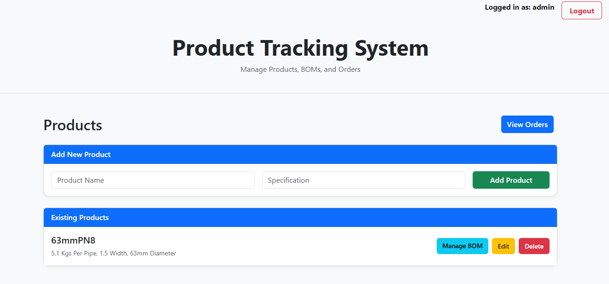
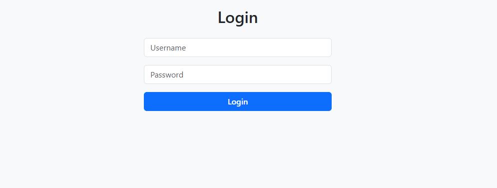
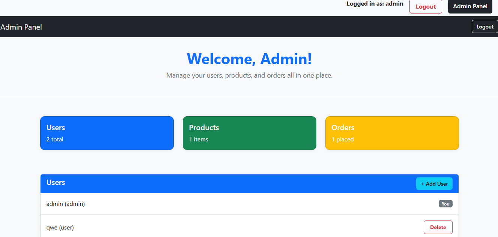
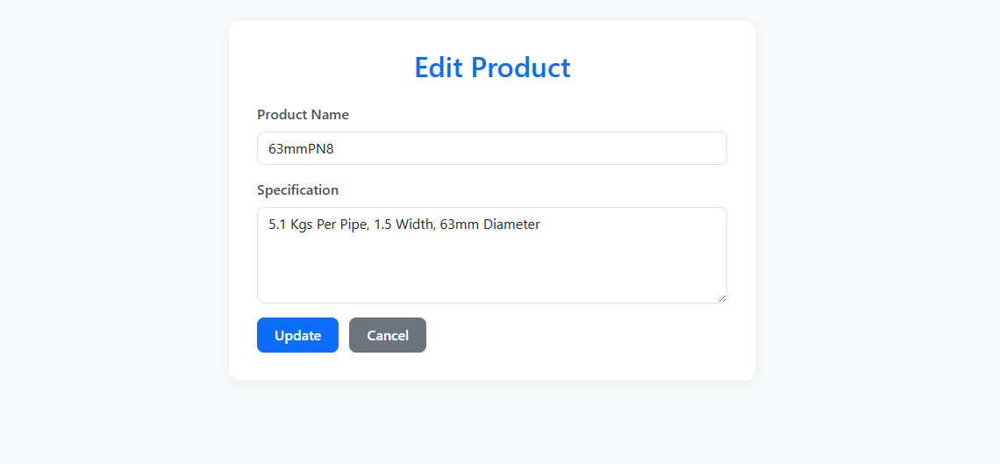
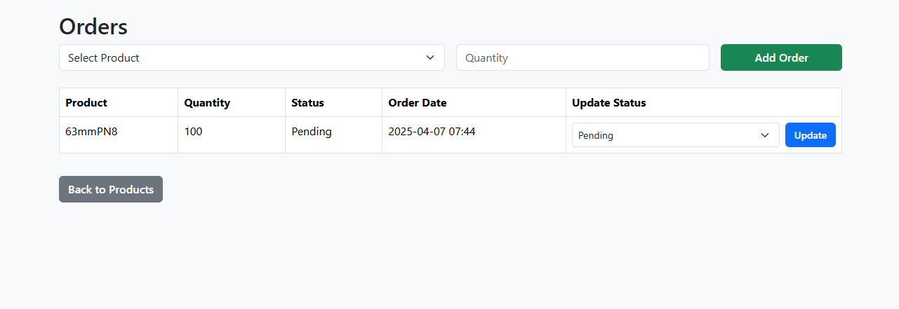

# Product Tracking System
MyPTS – Product Tracking System
MyPTS (Product Tracking System) is a web-based inventory and order management application built using Flask, SQLAlchemy, and Bootstrap. It helps users manage products, track their Bill of Materials (BoM), and handle customer orders in an organized and efficient way.

🚀 Features
🔐 User Authentication
Secure login system with role-based access (e.g. admin, user).

📦 Product Management

Add, edit, delete products

Attach specifications

🧮 Bill of Materials (BoM)

Assign components to products

View and update component quantities

📝 Order Management

Create and track orders

View order status and history

🎨 Responsive UI
Clean interface styled with Bootstrap 5 and custom SCSS

🛠️ Tech Stack
Backend: Flask, SQLAlchemy, Flask-Login, Flask-Bcrypt

Frontend: HTML, Bootstrap 5, SCSS

Database: SQLite (with optional SQL Server integration)

Auth: Flask-Login for sessions and user access control

